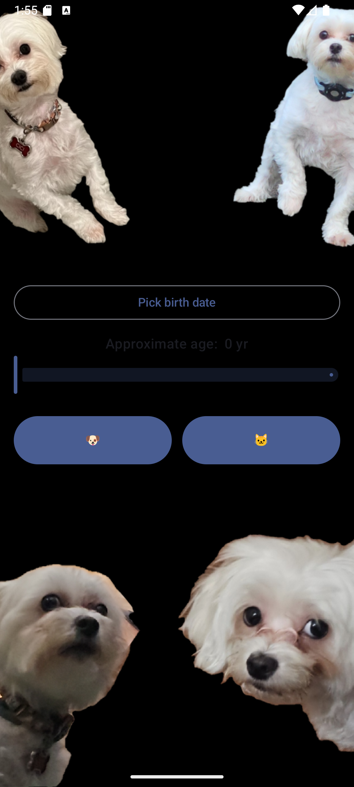

# Pet Age Converter 🐾

A modern Android application built with **Jetpack Compose** that converts your pet's chronological age to their human equivalent. Whether you have a dog or cat, this app uses scientifically-backed formulas to help you better understand your furry friend's life stage.

## Features

✅ **Dual Pet Support** - Convert ages for both dogs and cats  
✅ **Two Input Methods** - Pick your pet's exact birth date or approximate their age with a slider  
✅ **Material Design 3** - Modern, intuitive UI with smooth animations  
✅ **Accurate Calculations** - Industry-standard pet-to-human age conversion formulas  
✅ **Precise Results** - Get exact ages from birth dates or approximations from estimates  

## How It Works

### Age Conversion Formula

The app uses the widely accepted veterinary standard for pet age conversion:

- **Year 1**: Pet's 1st year ≈ 15 human years
- **Year 2**: Pet's 2nd year ≈ 9 additional human years (24 total)
- **Year 3+**: 
  - 🐶 **Dogs**: +5 human years per year
  - 🐱 **Cats**: +4 human years per year

### Usage

1. **Pick a birth date** using the calendar picker, or
2. **Manually set age** using the slider (0-30 years)
3. Tap **"🐶 Dog Years"** or **"🐱 Cat Years"** to convert
4. View your pet's human age equivalent

**Note**: When a birth date is selected, the slider is disabled for accuracy.

## Technical Details

### Tech Stack
- **Language**: Kotlin
- **UI Framework**: Jetpack Compose with Material Design 3
- **Build System**: Gradle (Kotlin DSL)
- **Target API**: 36 (Android 15)
- **Min API**: 26 (Android 8)
- **Java Version**: 11

### Key Dependencies
- `androidx.compose.material3` - Material Design 3 components
- `androidx.compose.material.icons` - Material Icons
- `androidx.lifecycle` - Lifecycle management
- `androidx.activity` - Activity integration

## Getting Started

### Prerequisites
- Android Studio Hedgehog or later
- JDK 11+
- Android SDK 26+

### Building

1. Clone the repository:
```bash
git clone <repository-url>
cd pet-age-converter
```

2. Build the project:
```bash
./gradlew build
```

3. Run on an emulator or device:
```bash
./gradlew installDebug
```

## Project Structure

```
pet-age-converter/
├── app/
│   ├── src/
│   │   ├── main/
│   │   │   ├── java/com/example/petageconverter/
│   │   │   │   └── MainActivity.kt          # Main activity with Compose UI
│   │   │   ├── res/
│   │   │   │   ├── values/
│   │   │   │   │   ├── colors.xml           # Color scheme
│   │   │   │   │   ├── strings.xml          # String resources
│   │   │   │   │   └── themes.xml           # Theme configuration
│   │   │   │   └── mipmap-*/ic_launcher*    # App icons
│   │   │   └── AndroidManifest.xml
│   │   └── test/                             # Unit tests
│   └── build.gradle.kts
├── gradle/
├── build.gradle.kts                          # Root build configuration
├── settings.gradle.kts
└── README.md
```

## Build Configuration

- **compileSdk**: 36
- **targetSdk**: 36
- **minSdk**: 26
- **ProGuard**: Enabled for release builds for code obfuscation

## License

This project is licensed under the LICENSE file included in the repository.

## Screenshots



---

**Made with ❤️ for pet lovers** 🐶 🐱
